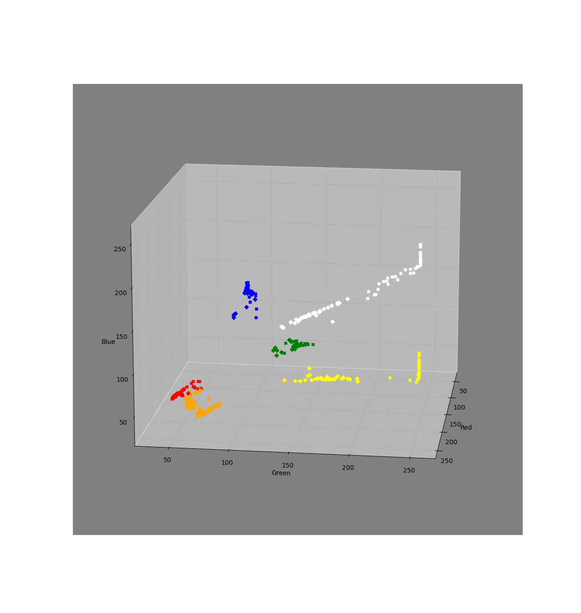

# Highschool project.

Usage: %s \[-t <solution string>\] to solve a cube XOR %s \[-s\] to scan cube.
Spinner needs to be port B, flipper port C and scanner port D.

Note that the colour sensor which was had in hand did not work properly, this is the reason why the program is split into two parts. See the graph below, the orange and red reads are overlap:

[Watch the machine in action](pictures/rubix.mp4)
